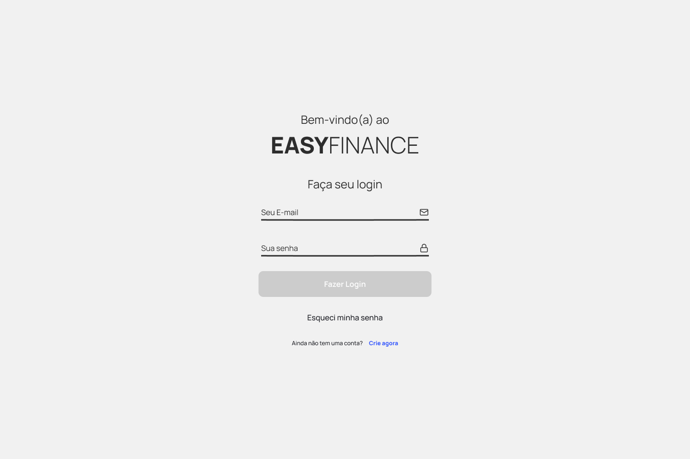

<p align="center">
  
</p>

## Tópicos

<div>
 • <a href="#-sobre-o-aion">Sobre o Aion</a> </br>
 • <a href="#-tecnologias">Tecnologias</a> </br>
 • <a href="#-layout">Layout</a> </br>
 • <a href="#-funcionalidades">Funcionalidades</a> </br>
 • <a href="#-estrutura-de-pastas">Estrutura de pastas</a> </br>
 • <a href="#-estrutura-do-banco-de-dados">Estrutura do banco de dados</a> </br>
 • <a href="#-como-executar-o-projeto">Como executar</a> </br>
 • <a href="#-como-contribuir">Como contribuir</a> </br>
 • <a href="#-autor">Autor</a> </br>
 • <a href="#user-content--licença">Licença</a></br>
</div>

## 💰 Sobre o Aion

O **Aion** é um software para gerenciamento e controle de finanças pessoais!

O projeto foi desenvolvido com o intuito de eliminar a utilização de planilhas para gerenciamento de controle financeiro. Através do armazenamento das informações através de transações, que podem ser definidas através de categorias, modalidades e tipo. A partir das definições do usuário, o projeto apresenta algumas informações em tela, e realiza determinadas análises da usabilidade do usuário.

Temos um modelo freemium, onde o usuário vai ter acesso a todas as funcionalidades padrão da aplicação, e apenas a parte de analise será para os usuários premium que irão assinar o plano.

Para auxiliar no desenvolvimento, todas as features foram implementadas em um board no modelo Kanban que esta armazenada no Notion, sabendo que as features MVP possuem maior prioridade.

## 🚀 Tecnologias

Tecnologias e ferramentas utilizadas no desenvolvimento do projeto:

#### **Website** ( [ReactJS](https://reactjs.org/) + [TypeScript](https://www.typescriptlang.org/) )

- [React Router Dom](https://reactrouter.com/)
- [Axios](https://github.com/axios/axios)
- [StyledComponents](https://styled-components.com/)
- [React Toastify](https://www.npmjs.com/package/react-toastify)
- [React Recharts](https://recharts.org/en-US/)

#### **Mobile** ( [React Native](https://reactnative.dev/) + [TypeScript](https://www.typescriptlang.org/) )

- [Expo](https://expo.dev/)
- [Axios](https://github.com/axios/axios)
- [StyledComponents](https://styled-components.com/)

#### **API** ( [NodeJS](https://nodejs.org/en/) + [TypeScript](https://www.typescriptlang.org/) )

- [Express](https://expressjs.com/pt-br/)
- [bcryptjs](https://www.npmjs.com/package/bcryptjs)
- [jsonwebtoken](https://www.npmjs.com/package/jsonwebtoken)
- [MongoDB Atlas](https://www.mongodb.com/atlas/database)
- [Mongoose](https://mongoosejs.com/)

#### **Utilitários**

- Protótipo: **[Figma](https://www.figma.com/)** → **[Protótipo (EasyFinance)](https://www.figma.com/file/OhR4sfXRpR2eO20o4T7mr9/EasyFinance)**
- Editor: **[Visual Studio Code](https://code.visualstudio.com/)** → Extensions: **[Prettier](https://prettier.io/)** + **[EditorConfig](https://editorconfig.org/)**
- Fontes: **Gotham**
- Versionamento: **[Git](https://git-scm.com)**
- Padronização de código: **[ESLint](https://eslint.org/)**

## 🎨 Layout

O layout da aplicação está disponível no Figma:

<p align="center">
  
</p>

## ⚙️ Funcionalidades

O projeto terá como a principal funcionalidade o armazenamento das transações implementadas pelo o usuário, pois só conseguiremos implementar as demais features após a implementação das transações.

### Page Overview

Essa página ser responsável por apresentar uma visão geral de como esta a vida financeira do usuário, apresentando alguns dados de receitas e despesas, e suas últimas transações realizadas

### Page Transactions

Essa página vai exibir para o usuário todas as transações armazenadas, e através de um modal, o usuário vai conseguir cadastrar novas transações, e também atualizar ou deletar uma transação existente.

### Page Analytics

Essa página vai ser responsável por apresentar para o usuário determinadas análises baseado na utilização e nas suas transações.

## 🛠 Estrutura de pastas e componentes

Afim de facilitar a organização e manutenção do código, foi definido um padrão para organização das pastas neste projeto.

**Front-end Web**

→ \_assets: Contém a estilização global, icones, fontes, tema da aplicação, itens de estilo que são reutilizáveis e imagens; <br />
→ components: Todos os componentes globais do projeto; <br />
→ constants: Contém constantes que são utilizadas globalmente na aplicação; <br />
→ context: Armazena os contextos da aplicação; <br />
→ services: Todos os acessos externos; <br />
→ utils: Funcionalidades que são utilizadas em diversos locais da aplicação; <br />
→ types: Todos as interfaces que são utilizadas em diversos locais da aplicação; <br />
→ hooks: Custom hooks; <br />
→ pages: Armazena todas as páginas da aplicação; <br />

<<<<<<< HEAD
Todos os componentes criados vão seguir a estrutura MVVM, com os seguintes arquivos:
→ index.tsx: Responsável por exportar o componente; <br />
→ component.styles.ts: Responsável por toda estilização do componente; <br />
→ component.view.tsx: Responsável por armazenar a View do componente, e toda a regra associada a interação com o usuário, tudo que é exibido na interface; <br />
→ component.view-model.ts: Responsável por armazenar a Model do componente, toda a regra de negócio exigida para o funcionamento do componente; <br />
→ component.tsx: Responsável por unir a interação com o usuário com a regra de negócio da aplicação, camada de dados do componente; <br />

Como cada página não deixa de ser um componente, todas as páginas são seguir a mesma estrutura de componentes, e os componentes que são utilizados apenas naquela página vão ser armazenados na pasta components dentro de pages.

=======
>>>>>>> 735bc619898cbf02c95133cb73e7fe04c83f2324
**Front-end Mobile**

→ \_assets: Contém a estilização global, icones, fontes, tema da aplicação, itens de estilo que são reutilizáveis e imagens; <br />
→ components: Todos os componentes globais do projeto; <br />
→ context: Armazena os contextos da aplicação; <br />
→ services: Todos os acessos externos; <br />
→ utils: Funcionalides que são utilizadas em diversos locais da aplicação; <br />
→ hooks: Custom hooks; <br />
→ routes: Armazena as rotas da aplicação; <br />
→ screens: Armazena as páginas da aplicação; <br />

Todos os componentes criados vão seguir uma mesma estrutura de organização:
→ index.tsx: Responsável por exportar o componente; <br />
→ interface.ts: Responsável por exportar as interfaces; <br />
→ styles.ts: Responsável por toda estilização do componente; <br />

**Back-end**

→ config: Armazena todos os arquivos de configurações; <br />
→ controllers: Armazena todos os Controllers da aplicação, utilizados para armazenar a regra de negócio; <br />
→ repositories: Armazena todos os Repositories da aplicação, utilizados para armazenar todo o vínculo ao banco de dados; <br />
→ database: Acesso ao banco de dados; <br />
→ models: Armazena todos os models utilizados para adicionar ao banco de dados; <br />
→ utils: Funcionalidades que são utilizadas em diversos locais da aplicação; <br />

**Componentes**

Todos os componentes criados vão seguir a estrutura MVVM, com os seguintes arquivos:
→ index.tsx: Responsável por exportar o componente como default; <br />
→ component.styles.ts: Responsável por toda estilização do componente; <br />
→ component.view.tsx: Responsável por armazenar a View do componente, que é toda a estilização do componente e toda a regra associada a interação com o usuário; <br />
→ component.view-model.ts: Responsável por armazenar toda a regra de negócio exigida para o funcionamento do componente, cria e exporta os estados do componente; <br />
→ component.tsx: Responsável por unir a interação com o usuário com a regra de negócio da aplicação, e armazenar todo o acesso aos dados; <br />

Como cada página não deixa de ser um componente, todas as páginas são seguir a mesma estrutura de componentes, e os componentes que são utilizados apenas naquela página vão ser armazenados na pasta components dentro de pages.

Para criar um novo componente, vamos utilizar o padrão do scaffolding

**Importações**

→ As importações no projeto vão seguir uma mesma padronização

1. React e libs
2. Tipagens
3. Componentes
4. Funções, utilitários e libs externas
5. Estilização

## 🚀 Como executar o projeto

Este projeto é divido em três partes:

1. Backend (pasta api)
2. Frontend Web (pasta client)
3. Frontend Mobile (pasta app)

💡 O Frontend precisa que o Backend esteja sendo executado para funcionar.

### Pré-requisitos

Antes de começar, você vai precisar ter instalado em sua máquina as seguintes ferramentas: <br />
→ [Git](https://git-scm.com);<br />
→ [Node.js](https://nodejs.org/en/);<br />

Além disto é bom ter um editor para trabalhar com o código como [VSCode](https://code.visualstudio.com/);

#### 🎲 Rodando a aplicação (Backend)

```bash
# Clone este repositório
$ git clone https://github.com/vitorrsousaa/EasyFinance.git
# Vá para a pasta da aplicação Front End
$ cd api
# Instale as dependências
yarn install
# Rode a aplicação
yarn start
# A aplicação será aberta na porta:3001 - acesse http://localhost:3001
```

---

#### 🧭 Rodando a aplicação web (Frontend)

```bash
# Clone este repositório
$ git clone https://github.com/vitorrsousaa/EasyFinance.git
# Vá para a pasta da aplicação Front End
$ cd client
# Instale as dependências
yarn install
# Rode a aplicação
yarn start
# A aplicação será aberta na porta:5173 - acesse http://localhost:5173
```

---

#### 🧭 Rodando a aplicação mobile (Frontend)

```bash
# Clone este repositório
$ git clone https://github.com/vitorrsousaa/EasyFinance.git
# Vá para a pasta da aplicação Front End
$ cd app
# Instale as dependências
yarn install
# Rode a aplicação
yarn start
# A aplicação será visualizado através do [Expo](https://expo.dev/) em um dispositivo físico ou emulador (Android ou iOS)
```

---

# 💭 Como contribuir

Caso queira contribuir, seja corrigindo bugs, adicionando comentários ou novas features, você pode seguir o seguinte tutorial:

- Faça um **[fork](https://help.github.com/pt/github/getting-started-with-github/fork-a-repo)** desse repositório
- **[Clone](https://help.github.com/pt/github/creating-cloning-and-archiving-repositories/cloning-a-repository)** o repositório que você fez o fork em seu computador
- Crie uma branch com a sua feature: `git checkout -b minha-alteracao`
- Envie suas alterações para a _staging area_: `git add .`
- Faça um commit contando o que você fez: `git commit -m "feat: minha nova alteracao!"`
- Faça um push para a sua branch: `git push origin minha-alteracao`
- Agora é só abrir uma _pull request!_

_Caso tenha alguma dúvida, confira este [guia de como contribuir no GitHub](https://github.com/firstcontributions/first-contributions/blob/master/translations/README.pt_br.md) :)_

<br />

# 📝 License

<br />

# 📮 Entre em contato

**Linkedin**: https://www.linkedin.com/in/vitorr-sousaa/

Desenvolvido por **Vitor Sousa** 👋🏻🧑
